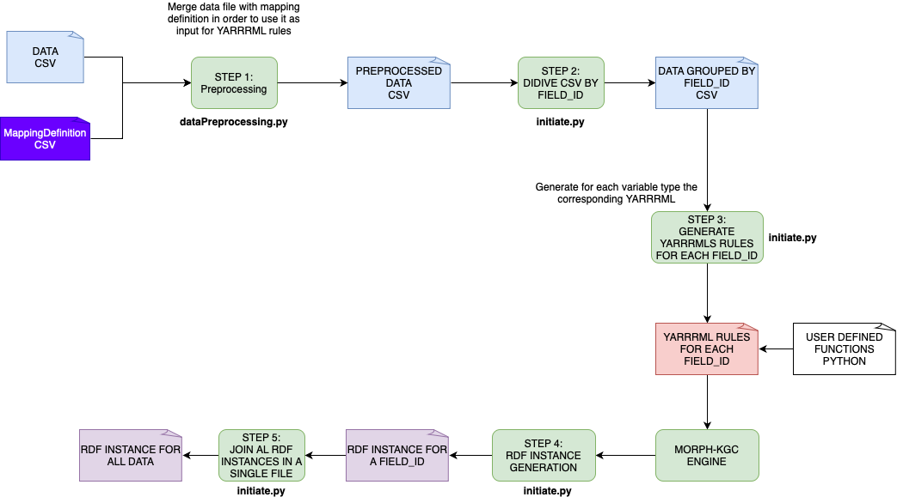

# RDF transformation pipeline
Data pipeline for representing data according to the RERS-Q+ ontology


## Steps in the Pipeline

### Step 1: Preprocessing

```bash
python3 dataPreprocessing.py ../input_data/data-extended.csv ../input_data/mappings.csv ../preprocessed_data
```
### Step 2 - Step 5:

Create under upload the following folders: csv, instances, rules

```bash
python3 initiate.py ../
```
